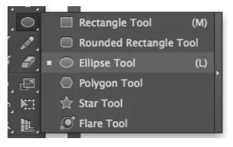
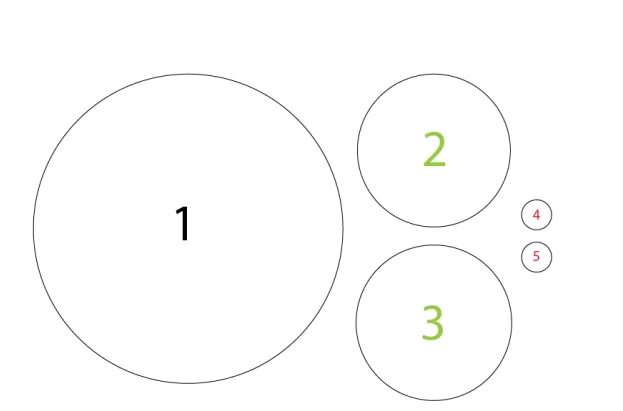
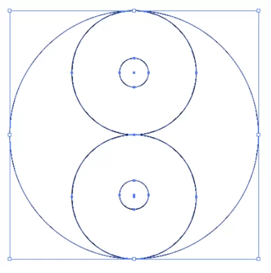
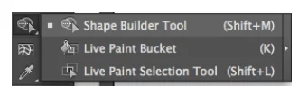
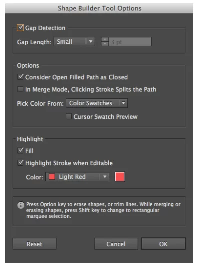
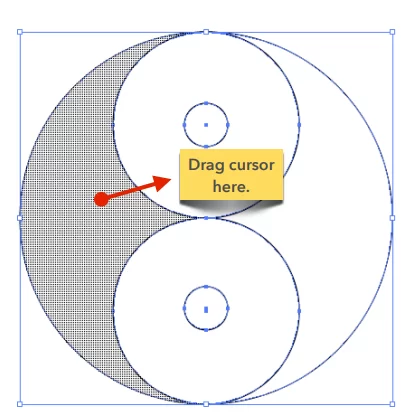
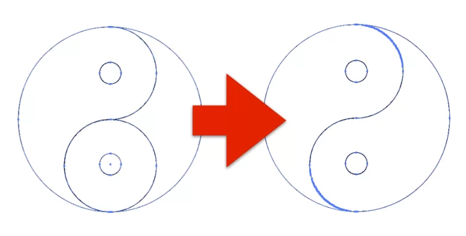
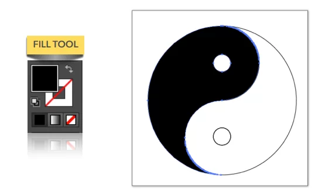
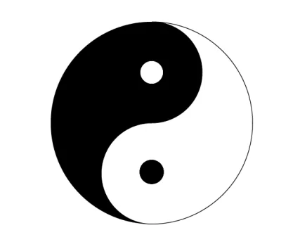

# Cómo usar la herramienta Shape Builder

1- Abre un nuevo documento haciendo clic en FILE -> NEW.

2- Escribe todas las propiedades que necesitas para crear un nuevo documento y luego haz clic en OK.

3- En tu espacio de trabajo, empieza a dibujar las formas que necesites. En este ejemplo, vamos a crear una forma de Yin Yang, por lo que tendremos que utilizar la herramienta ELLIPSE TOOL para dibujar varios círculos. Para ello, necesitamos hacer un conjunto de 5 círculos como se ve a continuación:

4- Luego tendremos que organizar y alinear cada círculo dentro del círculo más grande quedándonos un resultado similar a este:

5- Después de alinear los círculos, selecciona todo utilizando la acción SELECTION TOOL.

6- Haz doble clic en la herramienta SHAPE BUILDER o pulsa SHIFT + M en tu teclado.

7- Aparecerá la ventana SHAPE BUILDER TOOL OPTIONS. Asegúrate de marcar la casilla GAP DETECTION y establece la longitud de la separación en Pequeña (dependiendo del espacio de tus formas) y presiona OK.

8- De vuelta a tus círculos, notarás que el cursor resaltará la parte de la forma que estamos trabajando. Identifica las áreas que te gustaría combinar. En este ejemplo necesitaremos combinar la parte izquierda (que ya está resaltada) con el círculo superior interno de tamaño medio. Para lograrlo, arrastra el cursor hasta la forma que quieras unir.

9- Después de haber realizado el paso anterior, notarás que las formas se han combinado. Repite el proceso en el otro lado.

10- Resalta la mitad izquierda del círculo y coloréala en negro utilizando la acción FILL TOOL.

11- Haz lo mismo con el círculo más pequeño de abajo.

12- Ahora has unido con éxito las formas y las has convertido en un solo objeto. Ahora, puedes utilizar el resultado para complementar tus imágenes y tus proyectos.

