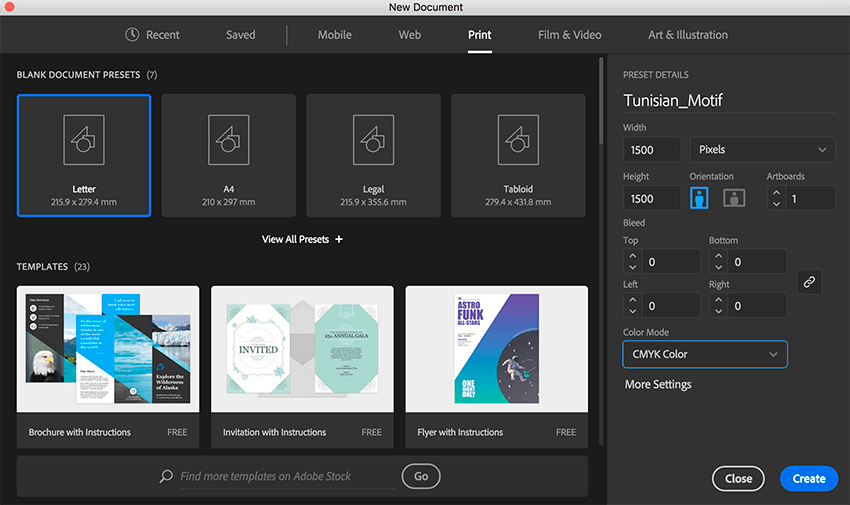

<!-- 
   -->

<h2>Menu</h2>

1. [Illustrator](#illustrator)
2. [Diferencias entre Illustrator y otras](#diferencias)
3. [Diferencias clave entre imágenes vectoriales e imágenes de mapa de bits](#diferencias-img-vectorial)
4. [Interfaz](#interface)

5. 

    
<b>Manejo de objetos</b>

    - [Seleccionar objetos](#seleccion-objeto)
    - [Aislar objetos](#aislar-objetos)
    - [Agrupaciones](#agrupaciones)
    - [Alinear y distribuir objetos](#alinear-objetos)
    - [Expandir objetos](#expandir-objetos)
    - [Ocultar y bloquear objetos](#ocultar-bloq-objetos)

    

# Illustrator

Adobe Illustrator es una aplicación de gráficos vectoriales estándar del sector que permite crear logotipos, iconos, dibujos, tipografías e ilustraciones complejas para cualquier medio. Es un editor gráfico vectorial desarrollado por Adobe, que se utiliza para crear una variedad de imágenes digitales e impresas, incluyendo dibujos animados, gráficos, diagramas, logotipos e ilustraciones.

La importancia de Adobe Illustrator en el diseño gráfico radica en que permite trabajar con gráficos vectoriales, uno de los formatos gráficos más utilizados en el diseño. Los gráficos vectoriales son imágenes que se crean a partir de líneas y formas geométricas y no pierden calidad al ser escalados o modificados. Esto significa que los diseños creados con Illustrator pueden ser escalados a cualquier tamaño sin perder calidad y son ideales para diseños que requieren precisión y detalles complejos.

### las diferencias entre Illustrator y otras herramientas de diseño, como Photoshop.

Adobe Illustrator y Photoshop son dos herramientas de diseño diferentes que se utilizan para diferentes propósitos como por ejemplo:

- Diseño gráfico y publicidad: Illustrator es una herramienta de diseño muy popular y ampliamente utilizada en la industria del diseño gráfico y la publicidad. Se utiliza para crear logotipos, iconos, dibujos, tipografías e ilustraciones complejas para cualquier medio.

- Arquitectura: Illustrator se utiliza en la creación de láminas o presentaciones de proyectos arquitectónicos.

- Automatización de tareas: Illustrator permite la creación de acciones que automatizan tareas repetitivas y ahorran tiempo.

Adobe Illustrator es una herramienta de diseño vectorial que se utiliza para crear diseños que requieren precisión y detalles complejos, como logotipos, ilustraciones y gráficos. Por otro lado, Photoshop es una herramienta de edición de imágenes que se utiliza para editar y retocar fotografías y otros tipos de imágenes complejas que contienen muchos detalles y variaciones sutiles en tono y color. 

### las diferencias clave entre imágenes vectoriales e imágenes de mapa de bits.

La principal distinción entre las imágenes vectoriales y las imágenes de mapa de bits radica en su estructura fundamental. Las imágenes de mapa de bits están compuestas por diminutos puntos llamados píxeles, siendo el píxel la unidad básica que se combina para formar una imagen completa. Por otro lado, las imágenes vectoriales se construyen a partir de líneas y curvas que se fusionan para dar forma a la imagen.

Las imágenes de mapa de bits son particularmente adecuadas para representar fotografías y otras composiciones visuales complejas que contienen una amplia variedad de detalles y variaciones sutiles en tono y color. Sin embargo, cuando se trata de diseños que requieren precisión y detalles intrincados, como logotipos, ilustraciones y gráficos, las imágenes vectoriales son la elección ideal.

La ventaja clave de las imágenes vectoriales reside en su capacidad para mantener la calidad y la claridad sin importar el tamaño al que se redimensionen, ya que las líneas y curvas conservan su definición y suavidad. Esto contrasta con las imágenes de mapa de bits, que pueden mostrar pérdida de calidad y bordes pixelados al ser ampliadas. Además, las imágenes vectoriales ofrecen una mayor flexibilidad en la edición, permitiendo ajustes y modificaciones precisas sin degradación visual.

Una imagen vectorial es una imagen digital que se crea a partir de líneas y formas geométricas. A diferencia de las imágenes de mapa de bits, las imágenes vectoriales no están formadas por píxeles, sino por vectores matemáticos.

Las principales características de las imágenes vectoriales son:

- Escalabilidad: Las imágenes vectoriales pueden ser escaladas a cualquier tamaño sin perder calidad.

- Edición: Las imágenes vectoriales son fáciles de editar y modificar.

- Precisión: Las imágenes vectoriales son ideales para diseños que requieren precisión y detalles complejos.

# Interfaz

### Barra de menús:
Es la barra superior desde la que se despliegan los menús, como Archivo o Edición. Esta barra es común a la mayoría de las aplicaciones Windows, por lo que ya conocerás su funcionamiento.

### Panel de herramientas:
En el lateral izquierdo encontramos este panel, que agrupa las herramientas de dibujo, edición, etc. Algunas herramientas aparecen agrupadas en un mismo icono, el cual se diferencia por tener un triangulito en su esquina inferior derecha. Para desplegarlas, hay que mantener pulsado el ratón unos segundos. También podemos acceder a sus propiedades haciendo doble clic.

### Panel de control:
En esta barra, situada debajo de la Barra de menús, aparecen opciones propias del objeto que tengamos seleccionado. Por lo que estas opciones variarán según el tipo de objeto. También podemos referirnos a ella como Barra de opciones.

### Paneles:
Los paneles o paletas, normalmente situados a la derecha, muestran un grupo de opciones y propiedades relacionadas, como puede ser el Navegador, Color o Pinceles. Pueden estar agrupados en el Menú o Grupo de paneles, o podemos encontrarlos flotantes, y aparecer apilados o acoplados. Todos los paneles se pueden agregar desde el menú Ventana.

### Ventana del documento:
Cada uno de los documentos aparece en una ventana, que podemos minimizar, maximizar o cerrar. En la esquina izquierda de esta ventana encontramos el Zoom para aumentar o disminuir el documento. También es denominada Ventana de ilustración.  
Dentro de esta ventana, podemos encontrar otros elementos. Los principales son la mesa de trabajo, que indica el tamaño de la página en la que se imprimirá el documento, y el área de recorte, que delimita la parte del documento que se exportará o publicará.

### Barra de menús

La Barra de Menús tiene como propósito facilitar el acceso a las distintas utilidades del programa. Es similar a la de cualquier otro programa de diseño web o gráfico, aunque tiene algunas particularidades. Los principales submenús a los que se puede acceder son:

**Archivo:** Permite crear nuevos archivos, abrirlos y brinda distintas opciones de guardado. También permite configurar la impresión de las páginas e imprimirlas.

**Edición:** Es el clásico menú que te permite cortar, copiar, pegar... tanto objetos como dibujos; También permite editar colores, el diccionario y realizar ajustes; personalizar algunas de las opciones más comunes del programa.

**Objeto:** Todos los dibujos que aparecen en un documento de Illustrator son objetos. Todos los objetos se crean a partir de trazados elementales. En este sentido, el trazado abierto o cerrado es el objeto más básico de Illustrator. La finalidad de los objetos es que puedan editarse, es decir, puedan cambiarse sus propiedades sin necesidad de volver a dibujar los trazados que los forman. Los objetos se pueden expandir, es decir, dividirlos en los distintos objetos que componen su apariencia, para modificar otros atributos y propiedades de elementos determinados. Al expandir un objeto, éste se convierte en otro objeto perdiéndose las posibilidades de edición del primer objeto, pero manteniendo la apariencia.
Hay muchos tipos de objetos. Desde las opciones del menú Objeto (imagen derecha), podemos crear y editar diversos objetos.

**Texto:** Las funciones de texto son uno de los aspectos más importantes de Adobe Illustrator. Puede añadir una sola línea de texto a la ilustración, crear columnas y filas de texto, hacer que el texto adopte una forma o siga un trazado, y trabajar con formas de letras como si fueran objetos gráficos. Las fuentes y los ajustes disponibles en Illustrator para interlineado y espaciado antes y después de los párrafos son algunas de las opciones con las que cuenta para modificar el aspecto del texto de la ilustración.

**Seleccionar:** Los comandos de selección permiten seleccionar o deseleccionar rápidamente todos los objetos, y seleccionar objetos según su posición respecto a otros objetos. Puede seleccionar todos los objetos de un tipo determinado o que compartan atributos concretos, y guardar o cargar las selecciones. También puede seleccionar todos los objetos de la mesa de trabajo activa.

**Efecto:** En el menú *Efecto* encontramos muchas posibilidades de diseño que se pueden aplicar a los trazados. Al aplicar un efecto, este se muestra en el panel Apariencia, donde aparece una línea que lo indica. Estos efectos pueden ser editados haciendo clic sobre esa línea de texto. Al hacerlo, se despliega el panel del efecto correspondiente, permitiendo ser modificado.

**Ver:** Además de los típicos Zooms, te permite varias opciones de previsualización, reglas y cuadrículas, edición de vistas, entre otros submenús.

**Ventana:** Este menú, además de las opciones clásicas acerca de cómo distribuir las ventanas, incluye accesos directos a todos los paneles y también la posibilidad de crear tus propios Espacios de Trabajo, guardarlos, cargarlos, etc.

### Panel de herramientas.

En el lateral izquierdo encontramos este panel, que agrupa las herramientas de dibujo, edición, etc. Algunas herramientas aparecen agrupadas en un mismo icono, el cual se diferencia por tener un triangulito en su esquina inferior derecha. Para desplegarlas, hay que mantener pulsado el ratón unos segundos. También podemos acceder a sus propiedades haciendo doble clic.

# Manejo de objetos

El dibujo de objetos en Illustrator es una tarea que, si bien tiene diversas características dependiendo de la herramienta utilizada, resulta bastante sencilla. Por ejemplo, para dibujar un rectángulo, basta con seleccionar la herramienta del mismo nombre , o pulsar su abreviatura (M), luego hacer clic con el botón izquierdo del ratón sin soltarlo para establecer uno de sus vértices, desplazar el ratón por la mesa de trabajo y luego soltarlo en el lugar donde quedará el vértice opuesto.

Una vez dibujado el rectángulo será un objeto con determinadas propiedades, como su anchura, altura, grosor de trazo y propiedades de relleno, que pueden ser no sólo el color, sino también su nivel de opacidad. Para que un objeto sea visible en la mesa de trabajo, asegúrate que tenga un grosor de trazo, color del mismo, así como color de relleno. Estas tres propiedades puedes establecerlas antes de crear cualquier objeto usando los primeros tres controles del Panel de Control que, como ya vimos, está bajo la barra de menús.

Los objetos en Illustrator son los elementos que conformarán la ilustración y son independientes entre sí. Esto significa que podemos editarlos o incluso eliminarlos sin afectar a otros objetos en la misma ilustración, lo que le da una gran flexibilidad al programa en la creación de diseños. En las próximas unidades no sólo veremos los detalles de la creación de los diversos objetos de dibujo, sino también los de su edición.

Pero primero, conoceremos su manejo, ya que a los objetos los podemos agrupar, seleccionar de diversas maneras, alinear, apilar, disponerlos en capas, etcétera.

Veamos pues el manejo de objetos en Illustrator, para luego facilitar el trabajo de su construcción, disposición en la mesa de trabajo y edición, entre otras posibilidades.

### Seleccionar objetos

Para modificar un objeto, cambiar sus propiedades, eliminarlo... en definitiva, para trabajar con él, lo primero que debemos de hacer es seleccionarlo.

Cuando uno o varios objetos están seleccionados, es a esos objetos a los que se le aplican propiedades que podamos cambiar, como el color, y son sus opciones las que se muestran en el Panel de control.

La forma más simple de seleccionar un objeto es haciendo clic sobre él con la herramienta **Selección** , o trazando un cuadrado con esta herramienta que abarque total o parcialmente a todos los elementos a seleccionar.

Cuando el objeto aparece seleccionado, podemos ver un recuadro que lo delimita. Si se trata de más de un objeto, entonces el recuadro los abarca.
 
 

Observa que el cursor mostrará un cuadradito negro  cuando lo situemos sobre un objeto que se puede seleccionar.

Si queremos añadir objetos a la selección, basta con seleccionar los nuevos objetos manteniendo pulsada la tecla Mayúsc(shift). Si mientras pulsamos esta tecla, hacemos clic sobre un objeto ya seleccionado, se deseleccionará.

Podemos utilizar esta herramienta sin cambiar la que estemos utilizando pulsando la tecla Ctrl.

De forma muy parecida podemos seleccionar con la herramienta **Selección directa** , aunque como ya veremos, esta herramienta está más enfocada a seleccionar puntos de ancla y segmentos. De cualquier modo, su uso es muy similar: podemos hacer clic sobre un objeto o dibujar un recuadro que toque uno o más objetos y éstos quedarán seleccionados. La diferencia es que no se mostrará un recuadro que los abarque, sino que cada objeto mostrará sus anclas y segmentos de trazo. En la siguiente imagen verás un objeto seleccionado por ambas herramientas, observarás fácilmente la diferencia.

  

Si queremos seleccionar varios objetos, pero al trazar un cuadrado con la herramienta selección, atrapamos más objetos de los deseados, podemos recurrir a la **herramienta Lazo** . Con esta herramienta, podemos dibujar el área de selección a mano alzada, y todos los objetos por los que pase, o que queden atrapados serán seleccionados.

Pero para el ejemplo de la imagen, podemos utilizar también la herramienta **Varita mágica** . Esta herramienta selecciona automáticamente todos los objetos con los mismos atributos que sobre el que hagamos clic. En este caso, al pulsar sobre una estrella, se han seleccionado todas, aunque si por ejemplo, hubiese habido círculos con el mismo trazo y relleno que las estrellas también se habrían seleccionado. Si pulsamos la tecla Mayúsculas, sumamos las características del objeto sobre el que pulsemos a la selección. En este ejemplo, si pulsásemos sobre una bola roja con la tecla Mayús., quedarían seleccionadas todas las estrellas y todas las bolas rojas.

Si hacemos doble clic sobre la herramienta **Varita mágica**, tendremos un panel que nos permite configurar su comportamiento. En él determinamos no sólo las propiedades similares que ha de buscar en otros objetos para incluirlos en la selección, sino que, además, podemos establecer el grado de tolerancia que ha de admitir en las semejanzas. Observa el panel.

A la izquierda marcamos las casillas de las propiedades a considerar, en tanto que en la caja de texto a la derecha, indicamos el porcentaje máximo de tolerancia a las discrepancias. Una tolerancia igual a cero hace que la varita mágica seleccione objetos con, por ejemplo, exactamente el mismo color de relleno que el objeto seleccionado. En tanto que una tolerancia igual a 100 equivale a seleccionar cualquier color de relleno. En nuestro ejemplo, al hacer clic en una estrella, tanto éstas como los círculos habrían quedado seleccionados.

Otra alternativa es utilizar la **Selección por propiedades**.

Observa la siguiente imagen.

Si pulsamos con la **Varita mágica** sobre un círculo negro, todos los círculos con ese relleno quedarán seleccionados (con selección directa), lo mismo si hacemos clic en los círculos morados, etcétera. Un método alternativo para conseguir los mismos resultados es configurar la herramienta de selección para seleccionar similares. Para ello debemos desplegar el menú del botón **Seleccionar objeto similares** que está en el Panel de control e indicar la propiedad por la que nuevos objetos serán seleccionados.

Una vez establecida la propiedad a considerar, podemos hacer clic en, por ejemplo, un círculo con relleno negro con la herramienta de selección y luego sobre el botón **Seleccionar objetos similares**. Todos los objetos que compartan la propiedad seleccionada con el objeto elegido, también quedarán seleccionados.

### Aislar objetos

En ocasiones, la edición de un objeto puede llegar a complicarse por la presencia de muchos objetos cercanos. Un error al hacer clic y manipular el ratón puede modificar un objeto no deseado. Para ello tenemos como alternativa la opción **Aislar trazado seleccionado** en el menú contextual.

Para que esta opción aparezca, debemos primero seleccionar el objeto a aislar. Luego pulsamos el botón derecho del ratón y seleccionamos la opción del menú contextual. El resto de los objetos aparecen entonces atenuados y no pueden ser seleccionados ni editados. Entonces podemos manipular libremente el objeto aislado sin temor a modificar accidentalmente algún otro.

Para concluir el aislamiento de objeto y volver al trabajo con el resto de la ilustración, simplemente pulsamos la tecla *Esc*.

### Agrupaciones

A medida que intentemos hacer dibujos más complejos, descubriremos que necesitamos que varios objetos formen uno sólo. Esto lo conseguimos a través de la **agrupación**. Al agrupar varios objetos, podemos tratarlos como una unidad. Podemos seleccionar todos a la vez, redimensionarlos conservando la proporción entre ellos, etc...

Para agrupar objetos, primero los seleccionamos y desde el menú emergente o el menú **Objeto**, seleccionamos **Agrupar** (Ctrl + G).

Si ahora intentas seleccionar un objeto del grupo como hemos visto hasta ahora, verás que se seleccionan todos.

Podemos también seleccionar varios grupos y agruparlos de nuevo. Esto convertirá a los primero grupos en subgrupos de un grupo mayor. De esta forma podemos crear una jerarquía de grupos.

En el menú encontramos también la opción inversa, **Desagrupar**. Este comando vuelve a separar los objetos del grupo. Si el objeto sobre el que ejecutamos esta acción pertenece a varios subgrupos, cada vez que pulsemos **Desagrupar** estaremos deshaciendo el grupo de mayor tamaño.

### Seleccionar objetos agrupados

Si necesitamos seleccionar un único elemento dentro de un grupo, no es necesario desagruparlo. Basta con hacer doble clic con la herramienta **Selección**  para entrar en el **modo de aislamiento** que ya mencionamos. Esto hace que los objetos que no pertenezcan al grupo se muestren atenuados, y no podamos seleccionarlos, pero sí los componentes del grupo, ya sean objetos u otros grupos. Si el objeto está en un subgrupo, podemos ir haciendo doble clic hasta llegar al grupo del objeto.

Si añadimos elementos al grupo aislado los nuevos objetos quedarán integrados en el grupo.

Para salir del asilamiento, basta con volver a hacer doble clic fuera del grupo.

Esto es útil cuando queremos editar el grupo, y la disposición de los elementos dentro de él. Pero para editar un único objeto, es más rápido utilizar las herramientas de selección que hemos visto, **Selección directa** , **Varita mágica**  y **Lazo** . Estas herramientas seleccionan los objetos independientemente de los grupos.

Agrupada con **Selección directa**, encontramos la herramienta **Selección de grupos** . Al hacer clic sobre un objeto con esta herramienta, lo seleccionaremos. Si volvemos a hacer clic, seleccionaremos el grupo que lo contiene. Con el siguiente clic, seleccionaremos el grupo que contenga a éste, y así sucesivamente, del grupo menor al mayor.

### Apilar objetos
 

De manera predeterminada, cada objeto nuevo dibujado se posiciona sobre el resto de los objetos ya existentes. La superposición de los objetos depende entonces del orden de apilamiento de los mismos conforme los vamos creando. Para modificar el orden de apilamiento de un objeto seleccionado, utilizamos las opciones del menú **Objeto** → **Organizar**.

Sin embargo, este modo de modificar el apilamiento de los objetos puede llegar a tornarse incómodo cuando hay un gran número de objetos apilados.

Una manera alternativa de organizar los objetos, no sólo por el apilamiento, sino también por sus caracteríticas, es ubicarlos en capas.

En un documento podemos crear varias capas. Las capas nos permiten trabajar con los elementos del documento en distintos niveles. Para hacernos una idea, podemos comparar las capas con una serie de láminas transparentes, en las que podemos dibujar de forma independiente, pero que si las superponemos vemos todas las láminas como un sólo dibujo. El orden de las capas determina el orden de los objetos. Esto hace que al superponer objetos de distintas capas, se muestre encima el objeto de la capa superior, y al fondo los de las capas inferiores. Por eso, se suele colocar los dibujos que forman el fondo de la ilustración en las capas de más bajo nivel.

Esto nos facilita el trabajo sobre todo en documentos más complejos, pudiendo tener en la primera capa el fondo, en la segunda dibujos más detallados, etc.

Para controlar las capas y movernos entre ellas, disponemos del panel Capas.

En este panel encontramos todas las capas. Si no las creamos, sólo tendremos una. A la izquierda del nombre de cada capa, hay un triángulo que expande o contrae la capa, mostrando los objetos que contiene. A su vez, cada capa puede contener una o más subcapas y éstas nuevos objetos.

A la izquierda tenemos dos columnas con iconos que pueden aparecer o desaparecer conforme hacemos clic: en la primera un ojo  que al pulsarlo **oculta** o **muestra** la capa, y un candado , que la bloquea impidiendo su edición.

Debajo, tenemos los controles que nos permiten crear o eliminar capas y subcapas. Haciendo doble clic sobre una capa, accedemos a sus propiedades, y podemos cambiar, por ejemplo, su nombre.

Hay que tener en cuenta que cuando tengamos más de una capa y dibujemos, lo estaremos haciendo sobre la capa seleccionada, la que aparezca resaltada en azul.

Por otra parte, podemos ubicar rápidamente un objeto en el panel de capas seleccionandolo en la ilustración y luego haciendo clic en el icono **Localizar objeto**, en la parte inferior del panel. Resaltará inmediatamente en el panel el objeto seleccionado, de modo que podremos ubicar la capa en la que se encuentra.

### Alinear y distribuir objetos

Muchas veces nos encontraremos con la necesidad de organizar nuestros objetos de forma automática, por ejemplo, que todos queden centrados, alineados a la derecha, o distribuídos dejando el mismo espacio entre ellos. Para hacerlo, tenemos las opciones de alineación y distribución de objetos.

Lo primero es seleccionar los objetos. Podemos utilizar los métodos de selección que hemos visto. Si queremos alinear o distribuir objetos, tomando uno como referencia, despues de haber seleccionado todos, volvemos a hacer clic sobre él. Esto lo convierte en el **Objeto clave**. Lo distinguimos porque queda enmarcado en un recuadro más grueso.

Una vez seleccionados, utilizamos el **Panel de control** o el panel **Alinear**.

 * Alinear objetos.

La alineación se puede hacer respecto a cualquiera de los cuatro lados del cuadro delimitador de un objeto, o a su centro en vertical u horizontal.

Para hacerlo, sólo hemos de pulsar el botón correspondiente. Si hemos marcado un objeto clave, el resto de objetos se alinearán con este. Si no, todos se alinearán al objeto más externo. Por ejemplo, si los alineamos a la izquierda, todos se alinearían con el objeto situado más a la izquierda, que no se movería.

Centrar objetos horizontal y también verticalmente nos resultará muy útil cuando necesitemos hacer coincidir el centro de varios objetos.

* Distribuir objetos.

Al distribuir objetos, lo que hacemos es que la parte de los objetos a la que estamos distribuyendo, queden a la misma distancia. Por ejemplo, si distribuimos al lado derecho, entre el lado derecho de un objeto y el anterior, habrá la misma distancia que entre el objeto y el siguiente.

 

Distribuir objetos tiene sentido cuando hay más de dos, ya que los extremos se toman como referencia, y no se mueven.

* Distribuir espaciado.

Esta opción, distribuye los objetos dejando entre ellos el mismo espacio, sin tener en cuenta su anchura. Podemos distribuirlos horizontal y verticalmente, eligiendo **Auto**, lo que calculará automáticamente el espacio, tomando como referencia los extremos, o introducir un valor específico, lo que colocará los objetos a esa distancia del anterior, partiendo del objeto clave.

Cuando alineamos o distribuimos objetos a un lado, y estos tienen distinto grosor en el trazo, el comportamiento es distinto dependiendo de la opción Usar delimitadores de previsualización que encontramos en el menú del panel Alinear.

Cuando está marcada, se toma como referencia el exterior de los bordes, y cuando está desmarcada, se toma como referencia el centro de los bordes (el contorno).

### Expandir objetos

Otra opción que puede resultarnos útil al crear nuestros dibujos es la de expandir. Esa opción divide el objeto original en objetos independientes, aunque los agrupa. Se crea un nuevo objeto por cada trazo que creó el objeto original.

Para expandir un objeto, lo seleccionamos y en el menú **Objeto**, seleccionamos **Expandir**.

En la siguiente imagen puedes ver un objeto simple, compuesto por un trazo y un relleno. Al expandirlo, hemos obtenido dos objetos, formados por el trazo y el relleno original.

Esto nos ha permitido, tras desagruparlos, separar el relleno original del trazo original.

A medida que avancemos en el curso veremos que el comando **Expandir** nos permite generar objetos a partir de efectos, o simplificar objetos compuestos.

### Ocultar y bloquear objetos.

Ya vimos que es posible ocultar capas y/o bloquearlas para evitar la visualización y/o edición de los objetos que contienen. También podemos bloquear y ocultar objetos individuales o agrupados independientemente de las capas. Sus efectos son los mismos: los objetos bloqueados u ocultos no se pueden seleccionar y, por tanto, tampoco editar.

Para definir los objetos que se bloquearan u ocultarán usamos el menú **Objeto** → **Bloquear** y **Objeto** → **Ocultar**, ambos con las siguientes subopciones.

## Herramientas de Dibujo

Una vez que hemos visto los elementos básicos para manipular objetos, es hora de crearlos y editarlos de diversas formas. Las herramientas de dibujo de Illustrator son bastas y con diversas opciones. El límite de lo que podemos dibujar con ellas está dado por la imaginación. Comencemos con los componentes de los propios objetos y sus propiedades, después vamos a utilizar las diversas herramientas de dibujo disponibles.

### El trazado
El dibujo vectorial se basa en **trazados**. Por tanto, al dibujar con las herramientas de Illustrator estamos creando trazados. Vamos a ver dos ejemplos de trazados muy simples.

Hemos dibujado el círculo con la herramienta lápiz a mano alzada, y el zig-zag con la herramienta pluma, haciendo un clic en cada vértice. El círculo forma un trazado cerrado, ya que sus extremos están unidos entre sí, mientras que el zig-zag es un trazado abierto.

La diferencia entre un trazado vectorial y un trazo dibujado en un mapa de bits, como hemos mencionado, es que el trazado vectorial es un objeto, que podemos seleccionar, modificar y eliminar, y que a su vez tiene otros elementos que nos permiten hacer todo esto. Para verlo mejor, vamos a seleccionar los trazados haciendo clic sobre ellos con la herramienta Seleccion directa Selección.

Cada uno de estos trazados se divide en segmentos, que pueden ser curvos o rectos. Distinguimos cada segmento porque se delimita con un cuadradito, tanto en el extremo como en la unión con otro segmento. Estos cuadraditos son los puntos de ancla, y aparecen oscuros cuando están seleccionados, y claros cuando no.

El trazado se divide en segmentos

En la imagen vemos que el círculo se compone de cuatro segmentos, y el zig-zag de tres.

Cuando los segmentos son curvos, encontramos también líneas de dirección, con puntos de dirección en sus extremos.

Para que las líneas y puntos de dirección se muestren, debemos seleccionar el segmento haciendo clic con la herramienta Selección directa Selección directa.